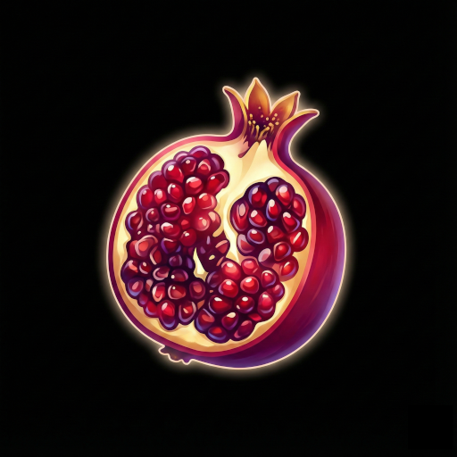

#  Magrana

A Fibonacci-based anagram puzzle game where you form words from a set of letters to progress through increasingly challenging levels.

**Magrana** is designed to be a relaxing yet engaging word puzzle that gradually increases in difficulty following the Fibonacci sequence. Each level requires you to find more words than the last—how far can you go?

## How to Play

The gameplay is simple but addictive:

- Form anagram words using exactly N letters from your available pool of N+M letters
- Each level requires a minimum number of words to advance (following the Fibonacci sequence: 5, 8, 13, 21...)
- The total number of possible words is shown in parentheses—can you find them all?
- Drag and drop letters between the answer area and the pool
- As you progress, levels get harder with more letters and higher word requirements
- Find special words to unlock emoji trophies (it's a surprise!)
- Achieve bronze, silver, or gold trophies by finding nearly all or all possible words

## Controls

- **Mouse/Touch**: Drag letters between the answer zone and the letter pool
- **Tap**: On mobile, tap letters to move them

## Features

- **Progressive Difficulty**: Fibonacci-based progression keeps the challenge fresh
- **Trophy System**: Earn medals for exceptional performance
- **Offline Play**: Full PWA support—play anywhere, anytime
- **Clean Design**: Beautiful tile aesthetics with smooth animations
- **Haptic Feedback**: Satisfying tactile response on mobile devices

## Dictionary

The word list is based on [SCOWL](http://wordlist.aspell.net/) (Spell Checker Oriented Word Lists) by Kevin Atkinson, specifically levels 10-50, which includes common to moderately common English words. Not all possible English words are included—the list is curated to exclude very obscure or rare terms.

## Credits

- **Icon**: Created with Nano Banana Pro
- **Initial Version**: Gemini
- **Final Development**: Claude Code (Anthropic)
- **Dictionary**: SCOWL by Kevin Atkinson

## License

MIT License - See LICENSE file for details

Dictionary source (SCOWL) is also freely licensed for use.

---

> **Note**: This game is designed for both mobile and desktop. While it works great on any modern browser, it's optimized for mobile play in portrait orientation.
